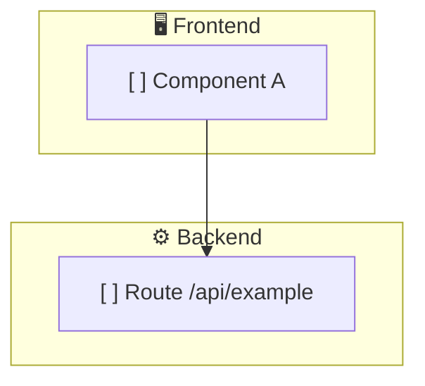

# App architecture graph

⚠️ TEMPLATE — ARCHITECT REPLACES THIS ENTIRE BLOCK DURING PLANNING ⚠️

Status: [ ] planned | [~] in progress | [✓] built | [✓✓] reviewed | [⚠] issue

Last updated: _(timestamp)_
Phase: _(Ideation | Research | Planning | Build | Review | Shipped)_

## Architecture

## Component changelog
| Date/Time | Component | Status | By |
|-----------|-----------|--------|-----|

## Open issues
| Date/Time | Issue | Status | Owner |
|-----------|-------|--------|-------|
